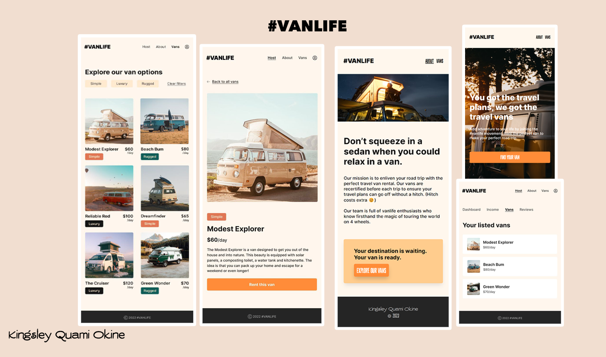

# VanLife

> This is a (fake) rental site for renting out decked camper vans

## Built With

- React
- Javascript
- SCSS
- Vite
- React Router 6

## Live Demo

- [App Live Link]()
 

## Getting Started

To get a local copy up and running follow these simple example steps.

### Prerequisites

- git
- Broswer to Display
- IDE to run and edit the code

### Setup

- open a terminal
- run ` git clone git@github.com:killy10o10/vanLife.git`
- run ` cd vanLife`
- run `npm install`
- run `npm run dev`
- Enter `http://127.0.0.1:5173/vanLife/` in your browser

### Usage

- It can be used to save lists of things to buy and access it anywhere on any device.

## Authors

👤 **Okine Kingsley**

- GitHub: [@killy10o10](https://github.com/killy10o10)
- Twitter: [@Quami_Killy](https://twitter.com/Quami_Killy)
- Instagram: [quami_killy](https://www.instagram.com/quami_killy/)

## 🤝 Contributing

Contributions, issues, and feature requests are welcome!

## Show your support

Give a ⭐️ if you like this project!

## Acknowledgments

- Hat tip to Bob Ziroll from the scrimba community for being such an awesome teacher.

## 📝 License

This project is [MIT](./LICENSE) licensed.
